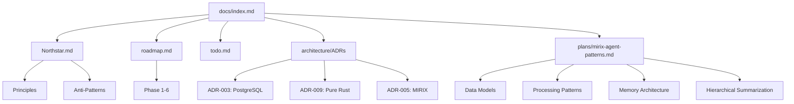

# Comprehensive Architecture Critique

> **Scope**: This critique evaluates the Recall Pipeline repository architecture with emphasis on documentation quality, completeness, and clarity. It incorporates findings from the MIRIX patterns extraction and oracle review.

---

## Executive Summary

The Recall Pipeline project demonstrates **strong architectural vision** with clear principles documented in Northstar.md and a well-defined 6-phase implementation roadmap. However, the repository exhibits significant **documentation drift** where multiple documents reference outdated information, and **architectural inconsistencies** between stated principles and actual implementation.

**Overall Grade: B-** (Good vision, execution gaps in documentation and consistency)

---

## 1. Plan Enumeration

### What's Great ✅

| Document | Strength |
|----------|----------|
| [`docs/roadmap.md`](../roadmap.md) | Clear 6-phase plan with status tracking, component locations, and CI expansion summary |
| [`docs/Northstar.md`](../Northstar.md) | Immutable principles, anti-patterns, and direct user quotes provide excellent context |
| [`docs/index.md`](../index.md) | Good central hub with ADR links and system diagram |
| [`docs/todo.md`](../todo.md) | Granular task tracking with priority levels and dependencies |

### What's Missing ❌

1. **No Executive Summary**: There's no single-paragraph "elevator pitch" that explains the project to a new visitor in 30 seconds.

2. **Success Criteria Undefined**: The roadmap lists phases but doesn't define what "done" looks like for each phase beyond component lists.

3. **Risk Register Absent**: No documentation of technical risks, mitigation strategies, or decision trade-offs beyond ADRs.

4. **Dependency Graph Missing**: While todo.md shows task dependencies, there's no visualization of how phases depend on each other.

### Recommendation

Add a `PROJECT.md` at repository root with:
- 2-paragraph project summary
- Current phase status badge
- Quick-start link
- Link to roadmap

---

## 2. Architectural Holes and Gaps

### 2.1 Critical Inconsistencies

#### Crate Naming Confusion

| Source | Claims | Reality |
|--------|--------|---------|
| [`AGENTS.md`](../../AGENTS.md) L13 | "workspace with 11 crates" | [`capture/Cargo.toml`](../../capture/Cargo.toml) shows 3 members: `recall-capture`, `recall-db`, `recall-store` |
| [`AGENTS.md`](../../AGENTS.md) Directory Structure | Lists `screenpipe-*` crates | These don't exist; actual crates are `recall-*` |

**Impact**: New contributors will be confused about what code actually exists.

#### Storage Strategy Contradiction

| Document | Position |
|----------|----------|
| [`AGENTS.md`](../../AGENTS.md) Tech Stack | "Local storage: SQLite/DuckDB" |
| [`docs/Northstar.md`](../Northstar.md) | "PostgreSQL Only: No SQLite" |
| [`docs/storage/st-overview.md`](../storage/st-overview.md) | "No SQLite. Postgres is the only storage engine." |

**Impact**: Developers may implement SQLite support thinking it's planned, when it's explicitly forbidden.

#### Status Code Divergence

| Source | Status Codes |
|--------|--------------|
| [`docs/Northstar.md`](../Northstar.md) | `0=Pending, 1=Done, 2=Error, 3=Skipped` |
| Python `agents/processors/ocr_worker.py` | `0→1→2→3→4` progression with `-1` for error |
| [`docs/orchestration/or-overview.md`](../orchestration/or-overview.md) | Correctly follows Northstar |

**Impact**: The Python reference implementation contradicts the canonical spec. This is documented in [`mirix-agent-patterns.md`](plans/mirix-agent-patterns.md) but the source files remain unchanged.

### 2.2 Architectural Gaps

#### Concurrency Bug in Python Workers

The [`mirix-agent-patterns.md`](plans/mirix-agent-patterns.md) oracle review identified that Python workers use `SELECT FOR UPDATE SKIP LOCKED` followed by a separate `UPDATE` without wrapping them in a transaction. In `asyncpg`, each statement runs in its own implicit transaction, so the lock releases between statements — **multiple workers can claim the same frame**.

**Mitigation**: The patterns document prescribes an atomic `UPDATE ... WHERE id IN (SELECT ... FOR UPDATE SKIP LOCKED) RETURNING *` pattern for the Rust reimplementation.

#### Missing `deployment_id` on `projects` Table

The hierarchical summarization schema in [`agents/database/create_hierarchy_tables.sql`](../../agents/database/create_hierarchy_tables.sql) lacks `deployment_id` on the `projects` table, violating Northstar's "deployment_id on every table" rule.

**Options**:
- **A**: Add `deployment_id` to `projects` (simple, compliant)
- **B**: Amend Northstar to allow cross-deployment tables (requires explicit exception)

#### Knowledge Vault Encryption Not Implemented

[`docs/Northstar.md`](../Northstar.md) requires: "Secrets must be redacted and stored encrypted (requiring FIDO2 key to decrypt)."

The Python reference stores `secret_value` as plaintext with only a `sensitivity` label. No FIDO2 integration exists.

### 2.3 Scalability Concerns

| Concern | Status | Impact |
|---------|--------|--------|
| Single Postgres instance | Documented | No horizontal scaling story for write-heavy workloads |
| No backpressure mechanism | Undocumented | Capture could overwhelm processing workers |
| No queue depth monitoring | Undocumented | Can't detect processing lag buildup |
| Embedding worker missing | Documented | Schema has `embedding_status` but no worker exists |

---

## 3. Low-Hanging Fruit for Enhancements

### 3.1 Documentation Quick Wins

| Task | Effort | Impact |
|------|--------|--------|
| Update AGENTS.md crate list to match Cargo.toml | Low | High |
| Remove SQLite/DuckDB from tech stack table | Low | High |
| Add Mermaid sequence diagram for worker poll-loop | Low | Medium |
| Create `PROJECT.md` executive summary | Low | High |
| Add ADR template to `docs/architecture/` | Low | Medium |

### 3.2 Architecture Quick Wins

| Task | Effort | Impact |
|------|--------|--------|
| Add `claimed_at`/`claimed_by` columns for lease-based processing | Medium | High |
| Add `deployment_id` to `projects` table | Low | Medium |
| Implement embedding worker (follows OCR/Vision pattern) | Medium | High |
| Add queue depth metrics to workers | Medium | High |

### 3.3 Testing Quick Wins

| Task | Effort | Impact |
|------|--------|--------|
| Add integration test for atomic claim pattern | Medium | High |
| Add property-based tests for dedup logic | Medium | Medium |
| Create test fixtures for sample frames | Low | Medium |

---

## 4. Documentation Quality Evaluation

### 4.1 Structure Analysis

```
docs/
├── index.md              ✅ Good hub, clear navigation
├── Northstar.md          ✅ Excellent vision document
├── roadmap.md            ✅ Clear phase tracking
├── todo.md               ✅ Granular task tracking
├── MasterDocumentationPlaybook.md  ✅ Good governance
├── standards.md          ⚠️ Just references playbook
├── architecture/
│   ├── adr-003.md        ✅ PostgreSQL decision
│   ├── adr-005.md        ✅ MIRIX agents
│   ├── adr-006.md        ✅ Windows first
│   ├── adr-008.md        ✅ Gradual extraction
│   └── adr-009.md        ✅ Pure Rust
├── capture/
│   └── cp-overview.md    ✅ Clear scope definition
├── orchestration/
│   ├── or-overview.md    ✅ Good worker documentation
│   └── or-routing.md     ⚠️ Not reviewed
├── storage/
│   └── st-overview.md    ✅ Clear schema documentation
├── dev/
│   └── testing.md        ✅ Comprehensive testing guide
├── plans/
│   ├── mirix-agent-patterns.md  ✅ Excellent extraction doc
│   ├── schema-unification-plan.md  ⚠️ Not reviewed
│   └── consolidation-2025-11.md   ⚠️ Not reviewed
└── archive/              ✅ Properly archived old docs
```

### 4.2 Coverage Assessment

| Category | Coverage | Notes |
|----------|----------|-------|
| Vision/Principles | ✅ Excellent | Northstar.md is comprehensive |
| Roadmap | ✅ Good | Phase tracking clear |
| ADRs | ⚠️ Gaps | Missing ADR-001, ADR-002, ADR-004, ADR-007 |
| API Reference | ❌ Missing | No OpenAPI specs for HTTP ingestion |
| Setup Guide | ⚠️ Partial | AGENTS.md has setup but outdated |
| Contribution Guide | ❌ Missing | No CONTRIBUTING.md |
| Architecture Diagrams | ⚠️ Minimal | Only ASCII diagram in index.md |
| Error Handling | ❌ Missing | No error code reference |
| Security | ⚠️ Partial | FIDO2 mentioned but not documented |

### 4.3 Readability Assessment

| Document | Clarity | Consistency | Currency |
|----------|---------|-------------|----------|
| Northstar.md | ✅ High | ✅ High | ✅ Current |
| roadmap.md | ✅ High | ✅ High | ✅ Current |
| AGENTS.md | ✅ High | ❌ Low | ❌ Outdated |
| index.md | ✅ High | ✅ High | ✅ Current |
| mirix-agent-patterns.md | ✅ High | ✅ High | ✅ Current |

### 4.4 Metadata Compliance

Per [`MasterDocumentationPlaybook.md`](../MasterDocumentationPlaybook.md), all docs should have YAML frontmatter with:
- `doc_type`, `subsystem`, `version`, `status`, `owners`, `last_reviewed`

| Document | Compliant | Issues |
|----------|-----------|--------|
| index.md | ✅ | None |
| Northstar.md | ✅ | None |
| roadmap.md | ✅ | None |
| AGENTS.md | ❌ | No frontmatter |
| testing.md | ✅ | None |

---

## 5. Overall Recommendations

### 5.1 Immediate Actions (This Week)

1. **Update AGENTS.md** to reflect current crate structure and remove SQLite references
2. **Create PROJECT.md** at root with executive summary
3. **Add missing ADRs** or renumber existing ones to fill gaps

### 5.2 Short-Term Actions (This Month)

1. **Implement atomic claim pattern** in Rust workers (fixes concurrency bug)
2. **Add `deployment_id` to `projects`** table
3. **Create Mermaid diagrams** for:
   - Worker poll-loop pattern
   - Hierarchical summarization flow
   - Multi-machine capture architecture

### 5.3 Medium-Term Actions (This Quarter)

1. **Implement embedding worker** following OCR/Vision pattern
2. **Add queue depth monitoring** and alerting
3. **Create CONTRIBUTING.md** with:
   - Development environment setup
   - PR checklist
   - Code style guidelines
4. **Document FIDO2 encryption** approach for Knowledge Vault

### 5.4 Documentation Governance

1. **Add CI check** for documentation frontmatter compliance
2. **Create documentation review checklist** for PRs
3. **Schedule quarterly documentation audits**

---

## 6. Strengths to Preserve

The project has several exemplary practices that should be maintained:

| Practice | Location | Value |
|----------|----------|-------|
| Immutable principles | Northstar.md | Prevents scope creep |
| Anti-patterns section | Northstar.md | Documents "why not" decisions |
| Phase-gated CI | roadmap.md | Tests only what's implemented |
| Reference code bug warnings | mirix-agent-patterns.md | Distinguishes design from implementation bugs |
| Northstar compliance checklist | mirix-agent-patterns.md | Ensures new code follows principles |
| Session completion workflow | AGENTS.md | Ensures work is pushed |

---

## Appendix: Document Cross-References



---

*Critique completed 2026-02-17 by Kilo Code Architect Mode*
